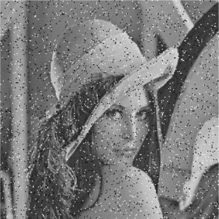

## VIA 515E
__HW 2__
__Due by Jun. 12th, 2019__

You may use your favorite programming environment/language/tool for the following exercises.

1. Add the following zero mean Gaussian noises, separately to red, green and blue channels of 256x256 colored "Lena" image, with standard deviations of 1, 5, 10, 20. Show resulting images.
2. Obtain gray scale images, I_1, I_5, I_10 and I_20by taking the average values of R, G, B channels corresponding to different noise levels.
3. Filter these images  using low-pass filters with kernels presented on pages 9 and 12 of “filter.pdf” document. Comment on the results.
4. Filter images in 2) using high-pass filters with kernels presented on pages 17 and 19 of “filter.pdf” document. Comment on the results.
5. Inspect Figure-1. Comment on the type of noise and propose a method to de-noise the image. Implement your method and present the de-noised image.

Figure –1: Noisy image.